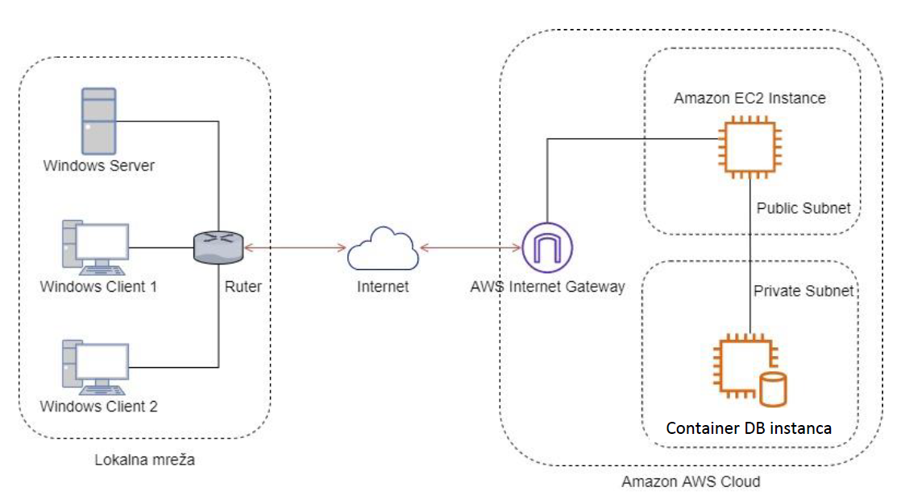

# ARM Project - Automated Deployment System

This project represents a complete infrastructure and application solution based on the **AWS (Amazon Web Services)** platform. The system uses **Terraform** for infrastructure provisioning, **Docker** for application and database containerization, **Apache** as a reverse proxy with SSL encryption, and **GitLab Runner** for the CI/CD pipeline.

The entire process of setting up the infrastructure, waiting for server configuration, packaging, and sending the code is fully automated through a PowerShell script that eliminates *race condition* issues.



## Running the Application:

### 1. Local Network Initialization
* Configure the local network architecture in VirtualBox using the NAT Network mode[cite: 7, 17, 21].
* Disable the built-in DHCP service within the VirtualBox NAT Network management settings.
* Boot the Windows Server virtual machine to activate domain controller services, dynamic address assignment, and name resolutions[cite: 24, 26, 27].
* Start Windows Client 1 and Windows Client 2 workstations to dynamically lease configuration values from the server[cite: 11, 16, 26, 33].

### 2. AWS Cloud Infrastructure Deployment
* Configure valid AWS CLI authorization credentials on your local administrative machine.
* Open a terminal interface and change directory to the infrastructure management folder:

```powershell
  cd terraform
  ./deploy.ps1
```

---

## System Architecture

The overall system architecture is split into two primary operational environments linked across the public internet.  

1. Local Network Environment (VirtualBox)
- Network Configuration: Operates inside a VirtualBox NAT Network using a custom-defined network address schema. The default VirtualBox DHCP environment is explicitly disabled.  
- Windows Server: Powered by MS Windows Server 2012 or a later release. It serves as the primary system coordinator, running Active Directory Domain Services, a configured DHCP scope, and central DNS routing zones.  
- Active Directory Organization: Contains dedicated user profiles for every participating team member alongside a singular structural domain group. Security permissions allow direct file exchange among domain accounts added to the group.  
- Windows Clients: Workstations running as virtual machines on physical computers located at the faculty. They dynamically pull their networking state parameters from the Windows Server DHCP authority and obtain individual domain names. Network paths allow full connectivity testing over raw IP endpoints or domain designations. Both nodes route through the gateway to access the public internet.  

2. Amazon AWS Cloud Environment
- VPC Subnet Layout: Features a dedicated Virtual Private Cloud (VPC) split into one public subnet zone and one isolated private subnet zone.  
- Internet Routing Boundaries: An allocated AWS Elastic IP address is mapped onto a public NAT Gateway. This layout allows instances in the private subnet zone to safely reach outbound internet repositories while blocking untrusted inbound connections.
- Security Group Rules: The public subnet is governed by a security group allowing all outbound packets, while restricting inbound traffic exclusively to SSH, HTTP, and HTTPS requests.
- Public Application Host: An EC2 instance running Ubuntu Server (22.04 LTS or newer). It runs an Apache2 web server managing a single active virtual host configuration. This machine coordinates a containerized application deployment via a shell-based GitLab Runner.
- Private Database Host: A dedicated EC2 instance isolated within the private subnet boundary. It runs a MySQL 8.0 relational engine enclosed inside a standalone Docker container (arm-db-container) to provide database services to the web application.  

---

## Configuration File Structure

### 1. Apache Configuration (`www.conf`)
Configured to automatically redirect to HTTPS and proxy traffic to the Node.js/external application.

- Where to check it: Found within the /etc/apache2/sites-available/ directory on the public EC2 Application Server.

- What it configures: Manages incoming external traffic targets for the active virtual host. It intercepts clear-text requests on port 80 and triggers a permanent 301 redirect forcing connections to the secure port 443. On port 443, it terminates custom SSL certificates and proxies matching requests directly to the application service listening locally on port 3000.

```apache
<VirtualHost *:80>
    ServerName local.arm.com
    ServerAlias [www.local.arm.com](https://www.local.arm.com)
    RewriteEngine On
    RewriteCond %{HTTPS} off
    RewriteRule ^(.*)$ https://%{HTTP_HOST}%{REQUEST_URI} [R=301,L]
</VirtualHost>

<VirtualHost *:443>
    ServerName local.arm.com
    ServerAlias [www.local.arm.com](https://www.local.arm.com)

    SSLEngine on
    SSLCertificateFile /etc/ssl/certs/[www.local.arm.com](https://www.local.arm.com).pem
    SSLCertificateKeyFile /etc/ssl/private/[www.local.arm.com](https://www.local.arm.com).key

    ProxyPreserveHost On
    ProxyPass / [http://127.0.0.1:3000/](http://127.0.0.1:3000/)
    ProxyPassReverse / [http://127.0.0.1:3000/](http://127.0.0.1:3000/)
</VirtualHost>
```

### 2. Multi-Container Orchestration (docker-compose.yml)
- Where to check it: Located in the root directory of your application project source code, and deployed to /opt/app/docker-compose.yml on the live App Server.

- What it configures: It defines the multi-container environment on the App Server. It manages the app container dependencies and implements a wait-for-db container image (using netcat loops) to ensure the web application doesn't try to boot until the isolated MySQL port on the private instance is alive.

### 3. Application Environment (Dockerfile)
- Where to check it: Located in the root directory of your application source code alongside the package files.

- What it configures: It contains the blueprinted steps to build your custom application container image. It specifies the base runtime environment (e.g., Node, Python, or .NET), copies your source files, installs the production dependencies, exposes port 3000, and sets the default execution command.

### 4. Application Server Provisioning Script (User Data)
Where to check it: Embedded inside your Terraform EC2 configuration files under the user_data argument for the public app server resource.

What it configures: Runs once at instance creation to install Docker, Docker Compose, Apache, and the GitLab Runner. It handles the initial SSL certificate generation, configures passwordless sudo for the runner, creates system environments, and outputs the deployment script to /opt/deploy.sh.

### 5. Database Server Provisioning Script (User Data)
Where to check it: Embedded inside your Terraform EC2 configuration files under the user_data argument for the private database instance resource.

What it configures: Executes on the private instance setup. It forces the system to wait until the NAT Gateway provides internet access, updates system packages, installs the bare Docker engine, and runs the official MySQL 8.0 image with strict environment variables and native password plugins.

## SSL Certificate Implementation

Per project guidelines, the application must present a valid SSL certificate, forcing all inbound web browsers to use a secure HTTPS connection format.  

Generation and Retrieval Steps

1. A cryptographic key pair is created on the local administration machine or cloud host using OpenSSL utilities.
2. The generated Certificate Signing Request parameters are uploaded and processed through the verification service at https://getacert.com/ to build a valid public X.509 SSL certificate.  
3. The resulting public certificate files and private key matches are saved onto the application server storage paths.  

Server Integration

The cryptographic components are linked inside the Apache configuration context using explicit parameters:
- SSLEngine on activates cryptographic processing for the virtual host environment.
- SSLCertificateFile targets the path pointing to the verified public certificate obtained from the authority
- SSLCertificateKeyFile targets the secret private key companion file stored on the local filesystem.

When any workstation routes a request to the web application, the user can inspect and verify the live cryptographic details through their browser interface.

## DNS Mapping & Corporate Network Integration

To fulfill communication goals between the local VirtualBox infrastructure and the remote AWS cloud platform, routing links are bound across both network boundaries:

- DNS Record Entry: The web application running on AWS is declared inside the DNS server domain mapping table on the private Windows Server machine. It is bound to a custom address matching the [something].arm.com or www.[something].arm.com layout.  
- Client Name Resolution: When active accounts logged into the Windows Client nodes input the chosen domain name into an internet browser, the local Windows Server DNS authority resolves the request to point straight to the AWS cloud gateway. 